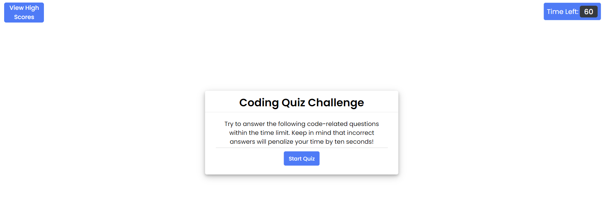

# Trials of Coding

## Description

This is an interactive Quiz App designed to test your knowledge about coding. This app features a countdown timer, multiple-choice questions, and a high score tracking system. Get ready to challenge yourself and compete with others for the top spot on the high score leaderboard!

## Table of Contents (Optional)

- [Installation](#installation)
- [Usage](#usage)
- [Credits](#credits)
- [License](#license)

## Installation

N/A. This is a website which is accessible with a browser navigator and internet connection. 

## Usage

When you enter the quiz, you are received by the instructions page with guidelines to play. Click on the "Start Quiz" button to begin the quiz. Once the quiz starts, a countdown timer will begin. Read the question and select the answer you think is correct by clicking on the corresponding option. If you choose the wrong answer, 10 seconds will be deducted from the remaining time. The app will immediately provide feedback on whether your answer was correct or incorrect. After completing the quiz, you'll be prompted to enter your initials to save your score, end the quiz, or replay the quiz. If you save your score, you are taken to the instructions page and then to the high score page, where You will be able to see the top scores. If you quit the quiz, you will be taken to the instructions page. If you replay the quiz, the timer restarts and you are immediately taken to the first question. 

## Credits

https://www.w3schools.com/html/html5_semantic_elements.asp

## License

Please refer to the license in the repo.
